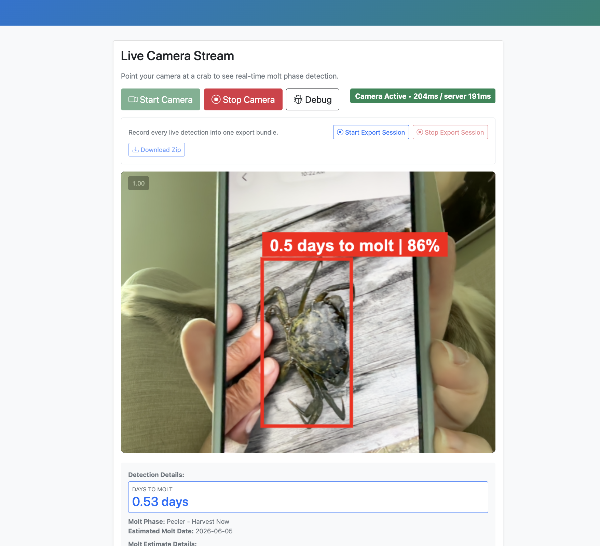

# MoltMeter Field Guide for Crab Harvesters

This guide explains how to use the MoltMeter app when you are sorting green crabs at an aquaculture site or field station. It assumes you are new to molt timing.

MoltMeter estimates how many days remain before a crab molts. This matters because a crab is most useful for soft-shell harvest shortly before it molts. The app is a sorting aid, not a replacement for your own handling judgment or an expert check.

## Quick Start

1. Open the app in your browser.
2. Click `Start Camera`.
3. Hold one crab in view with the whole body visible.
4. Wait for a bounding box and label to appear over the crab.
5. Read the `days to molt` estimate and confidence.
6. Put the crab in the farm bin that matches the estimate.

The streaming screenshots used for the live camera workflow are already saved in `static/` and listed below. The older upload screenshots are still useful as result examples, but the streaming captures are the canonical field guide images now.

## How to See the Bounding Boxes

Bounding boxes are rectangles drawn over detected crabs in the live camera view. The box tells you which crab the app is using for the molt estimate.

For best boxes:

- Put one crab in the center of the frame.
- Keep the whole crab visible.
- Use bright, even light.
- Avoid fingers, gloves, cage wire, and buckets covering the crab.
- Try both dorsal/top and ventral/belly views if the app does not find the crab.

When a box appears, the label on or near the box shows:

- `X.X days to molt`: the model estimate for the crab.
- `%`: detector confidence for the bounding box.

Example: `2.1 days to molt | 88%` means the app estimates the crab will molt in about 2 days, and it is fairly confident that the box is actually on a crab.

## How to Read Days to Molt

`Days to Molt` is the estimated number of days until the crab molts.

- A small positive number means the crab may molt soon.
- A larger number means the crab is earlier in the cycle.
- A negative number can mean the model thinks the crab recently molted.

The app also shows a phase name and recommendation. Use the number first, then use the phase/recommendation as a quick check.

These result screenshots show the upload pipeline. In live camera mode, read the same information from the bounding box label and the `Detection Details` panel below the video.

## Sorting Crabs into Farm Bins

Use literal holding bins or pots at the farm so crabs with similar molt timing stay together.

| App estimate | Suggested bin | What it means | Field action |
| --- | --- | --- | --- |
| Less than 0 days | `Post-molt / soft` | The crab may have recently molted. | Inspect by hand. Keep separate from pre-molt crabs. |
| 0 to 1 day | `Immediate` | Very close to molt. | Highest priority holding/harvest bin. Check frequently. |
| 1 to 3 days | `Peeler 1-3 days` | Prime soft-shell window is near. | Keep in the near-molt bin and monitor closely. |
| 3 to 5 days | `Near 3-5 days` | Approaching molt but not immediate. | Hold separately and re-check daily. |
| 5 to 14 days | `Early pre-molt` | Possible future peeler. | Keep in a longer-hold bin and re-check later. |
| More than 14 days | `Inter-molt / not close` | Not close to molting. | Return, hold separately, or process according to farm practice. |

If your farm uses different bin labels, map them to the same timing windows. The important part is to keep near-molt crabs separate from crabs that are not close.

## How to Read Confidence

There are two useful confidence signals:

- Bounding box confidence: the percent shown beside the box. This is how confident the detector is that the rectangle is on a crab.
- Estimate confidence: the text in Detection Details or the result card, such as `High Confidence`.

Use low confidence as a warning. If the box confidence is low, or if the box is on the wrong object, do not trust the molt estimate. Reframe the crab and try again.

## If No Bounding Box Appears

Sometimes the app still gives a molt estimate even when no box appears. This can happen because the molt estimator can run on the whole camera frame even when the crab detector did not find a confident crab crop.

When there is no box, read the estimate from `Detection Details`, not from a box label. The large `Days to Molt` value at the top of `Detection Details` is the app's best whole-frame estimate for the current image. Treat it as lower quality than an estimate with a clean bounding box around the crab.

Read these fields:

- `Crabs Detected`: if this is `0`, the app did not find a confident crab box.
- `Crop Used`: `No` means the app estimated from the full camera frame.
- `Input Source`: `whole_image_fallback` means the model did not get a clean crab crop.
- `Fallback`: the warning means you should take another view before sorting the crab.

How to use a no-box estimate:

- If `Days to Molt` is far from a sorting boundary, use it only as a rough hint and re-check the crab.
- If `Days to Molt` is near an important boundary, such as 3 days or 5 days, do not sort from that estimate alone.
- If the frame includes hands, gloves, buckets, cage wire, multiple crabs, or water glare, assume the whole-frame estimate may be contaminated.
- If a trained reviewer agrees with the estimate, write the expert estimate in `Debug` and capture it for the bundle.

When there is no box:

1. Do not make a final bin decision from that estimate alone.
2. Move the camera closer.
3. Center the crab.
4. Remove gloves, hands, cage edges, and other crabs from the frame if possible.
5. Try top and belly views.
6. Sort only after the box appears on the crab or after a trained reviewer confirms the estimate.

In short: a no-box `Days to Molt` can help you decide what to try next, but a clean bounding box is the normal standard for bin sorting.

## Recommended Streaming Screenshots

These files already exist in `static/`, so the guide can point directly at them instead of asking you to make new captures. If you want to refresh them later, use the same filenames.

Take these screenshots from the deployed app or local app:

1. `static/streaming_camera_start.png`: camera view after clicking `Start Camera`, before any crab is detected.
2. `static/streaming_bbox_estimate.png`: a crab with a clean bounding box and a readable `X.X days to molt | confidence` label.
3. `static/streaming_detection_details.png`: the `Detection Details` panel showing the large `Days to Molt` value, `Crabs Detected`, `BBox Confidence`, `Crop Used`, and `Input Source`.
4. `static/streaming_no_bbox_fallback.png`: a frame where no box appears but `Detection Details` shows `Crabs Detected: 0`, `Crop Used: No`, and `Input Source: whole_image_fallback`.
5. `static/streaming_debug_panel.png`: the `Debug` panel open with view, sex, molt details, expert estimate, notes, and `Capture`.
6. `static/streaming_export_session.png`: the export session panel showing `Start Export Session`, `Stop Export Session`, and `Download Zip`.

Suggested capture steps:

1. Open the app at `/ui`.
2. Use a phone or laptop camera in the same way a harvester will use it.
3. Click `Start Camera`.
4. Use the browser or operating system screenshot tool if you want to replace one of the existing images.
5. Save each image under the exact `static/` filenames above.
6. Keep the filenames unchanged so the guide links continue to work.

On macOS, press `Command-Shift-4`, drag around the app area, and save the screenshot. On Windows, use `Win-Shift-S`. On a phone, use the normal phone screenshot shortcut.

## Capture Debug: Record Known Bad Estimates

Biologists and experienced harvesters should use `Debug` when they know the app is wrong or uncertain. These captures are used for dogfood testing and model improvement.

Use debug capture when:

- The bounding box is on the wrong object.
- The crab is boxed correctly but the days-to-molt estimate is wrong.
- The app misses an obvious crab.
- The app gives a whole-image fallback that should have found a crab.
- A biologist has an expert estimate that disagrees with the app.

Steps:

1. Click `Start Camera`.
2. Click `Debug`.
3. Fill in `Location` if needed.
4. Choose the view: `dorsal`, `ventral`, `side`, or `unknown`.
5. Choose sex if known.
6. Mark incorrect detections such as `glove`, `human`, `cage`, `equipment`, or `other`.
7. Select molt details such as `halo visible`, `split visible`, or `blue hue`.
8. Enter an `Expert molt time estimate`, such as `2 days`, `tomorrow`, or `not close`.
9. Add notes explaining what is wrong or what the expert sees.
10. Click `Capture`.
11. Repeat for each useful example.
12. Click `Download Zip`.

The debug download bundle includes:

- Source camera images.
- Detection overlay images.
- Crab crop images.
- Bounding box thumbnails.
- `metadata.json` for each capture.
- `manifest.jsonl` for the session.
- `captures.xlsx` if spreadsheet support is installed, otherwise `captures.csv`.

The current debug session is overwritten when a new debug or export session starts, so download the zip before starting another session.

## Full Export Session: Record Everything

Use a full export session when you want to save a continuous set of live detections from a sorting session, not just selected mistakes.

Steps:

1. Click `Start Camera`.
2. Click `Start Export Session`.
3. Work normally while the app records live detections.
4. Click `Stop Export Session`.
5. Click `Download Zip`.

The export session download contains the same kind of files as debug capture: source images, overlays, crops, metadata, and spreadsheet/CSV summary. New export sessions overwrite old sessions.

Use full export sessions for:

- Dogfood testing by biologists.
- Comparing app estimates with manual sorting.
- Collecting examples from a real harvest workflow.
- Reviewing missed detections after a field day.

## Practical Field Rules

- Trust a clean box on the crab more than an estimate with no box.
- Re-check any crab that is close to the harvest threshold.
- Keep `0-3 days` crabs separate from `3-5 days` and `5+ days` crabs.
- Download debug/export bundles before starting a new session.
- Add expert notes whenever the app is wrong. Those examples are the most valuable for improvement.
